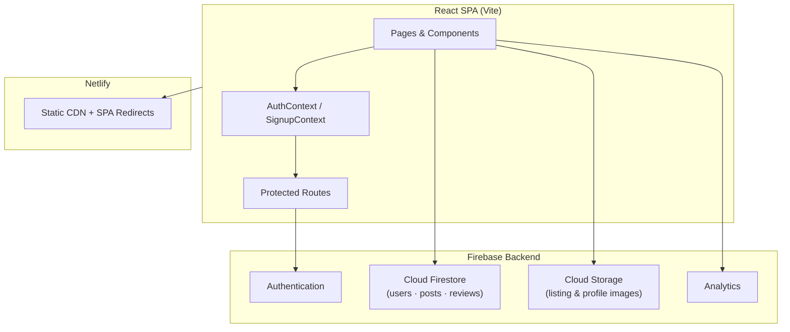

# Blue Haven Rentals

**Discover your perfect haven -a modern platform for finding and listing rental houses and boarding accommodations across Sri Lanka.**

[](https://bluehavenrentals.netlify.app/)
[](./LICENSE)
[](https://react.dev/)
[](https://vitejs.dev/)
[](https://firebase.google.com/)
[](https://tailwindcss.com/)

---

## Table of Contents

- [Overview](#overview)
- [Features](#features)
- [Tech Stack](#tech-stack)
- [Architecture](#architecture)
- [Getting Started](#getting-started)
- [Environment Variables](#environment-variables)
- [Available Scripts](#available-scripts)
- [Project Structure](#project-structure)
- [User Roles](#user-roles)
- [Deployment](#deployment)
- [Security](#security)
- [Contributing](#contributing)
- [License](#license)

---

## Overview

[Blue Haven Rentals](https://bluehavenrentals.netlify.app/) connects **renters** and **property owners** through a single, streamlined web experience. Seekers can search verified listings by location, property type, and capacity across all nine provinces of Sri Lanka. Owners can publish listings with photos, track approval status, and reach an active audience of renters.

Built as a full-stack web application with a React SPA frontend and Firebase backend, the platform includes role-based access control, an admin moderation workflow, analytics dashboards, and a review system -designed to scale from a university group project to a production-ready rental marketplace.

---

## Features

### For Renters (`boarding_finder`)

- **Smart search** -Filter by keyword, property type, guest count, and district
- **Browse listings** -Paginated results with image galleries and detailed property information
- **Location explorer** -Interactive map and province/district navigation covering all 25 districts of Sri Lanka
- **Reviews & ratings** -Star-rated feedback on approved listings
- **User profiles** -Manage account details and preferences

### For Property Owners (`boarding_owner`)

- **Multi-step onboarding** -Guided signup with location, ID verification, and profile photo upload
- **Listing management** -Create, edit, and track rental posts with Firebase Storage image uploads
- **Approval workflow** -Submissions enter a pending queue until reviewed by an admin
- **Owner dashboard** -View active, pending, and declined posts from the user profile

### For Administrators

- **Dashboard overview** -At-a-glance stats on users, posts, and platform activity
- **Post moderation** -Approve or decline pending listings before they go live
- **User management** -View, edit roles, and manage registered accounts
- **Analytics** -Charts for posts by category/location, user growth, and review metrics (powered by Recharts)

### Platform

- Firebase Authentication with email/password and password reset flow
- Protected routes with role-based access control
- Responsive, mobile-first UI with Tailwind CSS
- SPA routing with Netlify redirects for client-side navigation
- Firebase Analytics integration

---

## Tech Stack

| Layer              | Technology                                                           |
| ------------------ | -------------------------------------------------------------------- |
| **Frontend**       | React 19, React Router 7, Tailwind CSS 4                             |
| **Build Tool**     | Vite 7                                                               |
| **Backend / BaaS** | Firebase Auth, Cloud Firestore, Firebase Storage, Firebase Analytics |
| **Charts**         | Recharts                                                             |
| **Icons**          | Lucide React, React Icons                                            |
| **Hosting**        | Netlify                                                              |
| **Linting**        | ESLint 9                                                             |

---

## Architecture



**Data collections (Firestore):**

| Collection | Purpose                                                                               |
| ---------- | ------------------------------------------------------------------------------------- |
| `users`    | Profiles, roles, verification status                                                  |
| `posts`    | Rental listings with approval status (`pending` · `approved` · `declined` · `active`) |
| `reviews`  | User ratings and comments on listings                                                 |

---

## Getting Started

### Prerequisites

- [Node.js](https://nodejs.org/) 18 or later
- [npm](https://www.npmjs.com/) 9 or later
- A [Firebase project](https://console.firebase.google.com/) with Auth, Firestore, and Storage enabled

### Installation

```bash
# Clone the repository
git clone https://github.com/Werosh/Uni_Group_Project_Bording-Finder_Blue-Haven-Rentals_website.git
cd Uni_Group_Project_Bording-Finder_Blue-Haven-Rentals_website

# Install dependencies
npm install

# Configure environment (see below)
cp .env.example .env.local   # create and fill in your Firebase keys

# Start the development server
npm run dev
```

The app runs at **http://localhost:5173** by default.

### Firebase Setup

1. Create a Firebase project and register a web app
2. Enable **Email/Password** authentication
3. Create a **Cloud Firestore** database
4. Enable **Firebase Storage**
5. Configure [Firestore Security Rules](https://firebase.google.com/docs/firestore/security/get-started) and [Storage Rules](https://firebase.google.com/docs/storage/security) appropriate for your environment
6. Copy your web app config values into `.env.local`

---

## Environment Variables

Create a `.env.local` file in the project root:

```env
VITE_FIREBASE_API_KEY=your_api_key
VITE_FIREBASE_AUTH_DOMAIN=your_project.firebaseapp.com
VITE_FIREBASE_PROJECT_ID=your_project_id
VITE_FIREBASE_STORAGE_BUCKET=your_project.appspot.com
VITE_FIREBASE_MESSAGING_SENDER_ID=your_sender_id
VITE_FIREBASE_APP_ID=your_app_id
VITE_FIREBASE_MEASUREMENT_ID=your_measurement_id
```

> **Note:** Firebase client config values are public by design. Access control is enforced through Firebase Security Rules, not by hiding these keys.

---

## Available Scripts

| Command           | Description                          |
| ----------------- | ------------------------------------ |
| `npm run dev`     | Start Vite dev server with HMR       |
| `npm run build`   | Production build to `dist/`          |
| `npm run preview` | Preview the production build locally |
| `npm run lint`    | Run ESLint across the project        |

---

## Project Structure

```
├── public/                  # Static assets & Netlify SPA redirects
├── src/
│   ├── components/          # Shared UI (Navbar, Footer, Modal, Reviews, etc.)
│   ├── context/             # AuthContext, SignupContext
│   ├── firebase/            # Firebase config, auth, db, and storage services
│   ├── landing/             # Landing page composition
│   ├── pages/
│   │   ├── admin-pages/     # Admin dashboard, moderation, analytics
│   │   ├── landing-pages/   # Home, About, Categories, Location, Contact
│   │   ├── login-pages/     # Login & password reset flow
│   │   ├── main-pages/      # Browse listings, post creation form
│   │   ├── sign-up-pages/   # Multi-step registration wizard
│   │   └── user-pages/      # User profile & edit
│   ├── routes/              # AppRoutes, ProtectedRoute
│   └── utils/               # Profile helpers, admin setup utilities
├── netlify.toml             # Netlify build & deploy configuration
├── vite.config.js
└── package.json
```

---

## User Roles

| Role              | Description                  | Key Access                                   |
| ----------------- | ---------------------------- | -------------------------------------------- |
| `boarding_finder` | Renter seeking accommodation | Browse, search, review, profile              |
| `boarding_owner`  | Property owner / advertiser  | All finder access + create & manage listings |
| `admin`           | Platform administrator       | Full access including moderation & analytics |

Route protection is handled by `ProtectedRoute`, which gates pages based on authentication state and required role.

---

## Deployment

The live site is deployed on **Netlify**:

- **Build command:** `npm run build`
- **Publish directory:** `dist`
- **SPA routing:** Handled via `public/_redirects` (`/* /index.html 200`)

Connect your repository to Netlify, add the Firebase environment variables in the Netlify dashboard, and deploy. The `netlify.toml` file includes build settings and secret-scan omit keys for Firebase config variables.

**Live URL:** [https://bluehavenrentals.netlify.app/](https://bluehavenrentals.netlify.app/)

---

## Security

- All sensitive operations require Firebase Authentication
- Role-based route guards prevent unauthorized access to admin and owner-only pages
- Listing images are stored in Firebase Storage with rule-based access
- Environment files (`.env`, `.env.local`, `.env.production`) are excluded from version control
- Never commit service account keys or admin credentials

---

## Contributing

Contributions are welcome. To propose a change:

1. Fork the repository
2. Create a feature branch (`git checkout -b feature/your-feature`)
3. Commit your changes with a clear message
4. Push to your branch and open a Pull Request

Please run `npm run lint` before submitting and ensure the production build passes (`npm run build`).

---

## License

This project is licensed under the **MIT License** - see the [LICENSE](./LICENSE) file for details.

### Third-Party Open Source

Blue Haven Rentals depends on open-source packages released under their own licenses. Attribution and license summaries are documented in:

- [THIRD-PARTY-LICENSES.md](./THIRD-PARTY-LICENSES.md) - direct dependencies and dependency-tree summary
- [LICENSES/](./LICENSES/) - full text of all license types used by dependencies (MIT, Apache-2.0, ISC, BSD, MPL-2.0, and others)

Developed as a **Semester 4 university group project** by the Blue Haven Rentals team.

---

<p align="center">
  Built with care for renters and property owners across Sri Lanka.<br/>
  <a href="https://bluehavenrentals.netlify.app/">Visit Blue Haven Rentals →</a>
</p>
